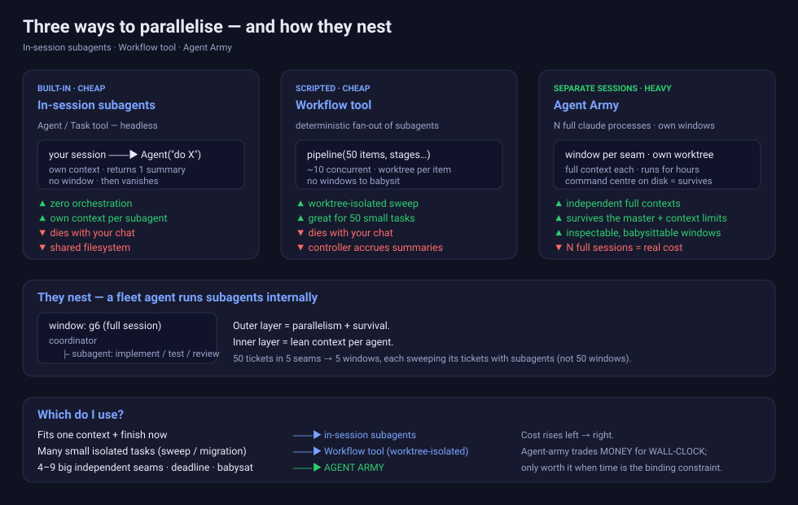

# agent-army

> Run a **fleet of autonomous Claude Code agents in parallel** — one per independent seam of work, each isolated in its own git worktree and branch, coordinated by a **changeable master** session through a **command centre that lives on disk**. The operation survives context limits and shift changes: any session can read the command centre and take command.

A Claude Code skill (packaged as a plugin) for the moment a big body of work is *already*
split into independent groups — epics with grouped stories, a stack of OpenSpec changes, a
migration across many sites — and you want to chew through them concurrently without one chat's
context window being the ceiling.



## Is this the right tool? (read this first)

Agent-army is the **heavyweight** option. It costs **N full Claude sessions**. Most "parallel
work" is cheaper and simpler with one of its two cousins — the skill opens with an **Intake
Gate** that routes you to the right one:

| Your work | Use |
|---|---|
| A few independent tasks you'll finish in one sitting | **In-session subagents** (`Agent`/`Task` tool) |
| Many small, isolated, mechanical tasks (a sweep / migration) | **Workflow tool** (worktree-isolated, in-session) |
| **4–9 big independent seams, deadline-bound, you'll babysit** | **Agent Army** (this) |
| Tightly coupled / ordered work | Sequential |

Agent-army trades **money for wall-clock**. It's only worth ~N× the spend when time is the
binding constraint *and* the work genuinely splits into independent, long-lived streams.
Full comparison: [`skills/agent-army/references/agent-army-vs-subagents.md`](skills/agent-army/references/agent-army-vs-subagents.md).
Interactive explainer: open [`docs/index.html`](docs/index.html).

## What you get

- **One agent per seam**, each a full `claude` process in its own window/tmux pane, own context
  window, own git worktree. They build concurrently for hours.
- **A command centre on disk** (`~/.claude/agent-army/<operation>/`) — manifest, per-agent
  briefs, per-agent status, runtime handles. The single source of truth; **any session can
  take command** by reading it.
- **Two-signal health** — self-reported status *plus* an objective probe (process alive + last
  commit + transcript activity). Silent stalls and lying launches can't hide.
- **Window tracking** — `where.sh` tells you exactly where each agent's window is and how to
  inspect or close it; `stop-agent.sh` closes it cleanly and kills idle-burn.
- **Context survival** — agents work subagent-driven (thin coordinator) and run a DYING
  protocol at ~80% context: commit, write a continuation, hand off to a fresh successor.
- **A master review gate** — spec-compliance then code-quality reviewer subagents, in-session,
  before anything merges.

## Commands (scripts)

```bash
SK=skills/agent-army/scripts
$SK/launch-agent.sh  <op> <agent> [--resume] [--terminal <name>] [--tmux]  # start one agent (visible window by default), verify, record handle
$SK/fleet-status.sh  <op>                                # objective health board
$SK/where.sh         <op> [agent]                        # where is each window + how to inspect/close
$SK/stop-agent.sh    <op> <agent> [--force]              # graceful close, verified (kills idle-burn)
```

## Install

agent-army ships in the [`amjad1233` skills marketplace](https://github.com/amjad1233/ai-skills). From a Claude Code session:

```
/plugin marketplace add amjad1233/ai-skills
/plugin install agent-army@amjad1233
```

Prefer editable files, or not on Claude Code? Use the [skills.sh](https://skills.sh/amjad1233/ai-skills)
installer instead — it copies the skill in and works on ~75 agents:

```
npx skills add amjad1233/ai-skills --skill agent-army
```

Then invoke the skill by asking for a fleet ("spin up an agent army for these 5 OpenSpec
changes") or whatever your harness uses to trigger skills. The skill **always runs the Front
Door first** — so it will talk you out of a fleet you don't need.

### Requirements
- [Claude Code](https://claude.com/claude-code)
- `jq`, `git` (worktrees), and a **visible terminal** — macOS Terminal.app/iTerm/Warp, Ubuntu/Linux
  GNOME Terminal/Konsole/xterm, or Windows Terminal/PowerShell. Pick one with `--terminal <name>`.
  SSH/headless uses `tmux` (`--tmux`); with no terminal at all it falls back to `nohup`.

## How it works

The lifecycle, the two-signal truth model, and the nesting (a fleet agent runs subagents
internally) are documented in:

- [`skills/agent-army/SKILL.md`](skills/agent-army/SKILL.md) — the skill itself, Intake Gate first.
- [`skills/agent-army/DECISIONS.md`](skills/agent-army/DECISIONS.md) — every design decision and the lesson behind it.
- [`docs/index.html`](docs/index.html) — visual explainer.

## Credit & lineage

The two-stage review gate, the fresh-subagent-per-task discipline, and the richer status
vocabulary (`DONE_WITH_CONCERNS` / `NEEDS_CONTEXT`) are adapted from the
[superpowers](https://github.com/obra/superpowers) `subagent-driven-development` skill —
agent-army applies the same pattern one level up, across separate sessions.

## Licence

MIT — see [LICENSE](LICENSE).
