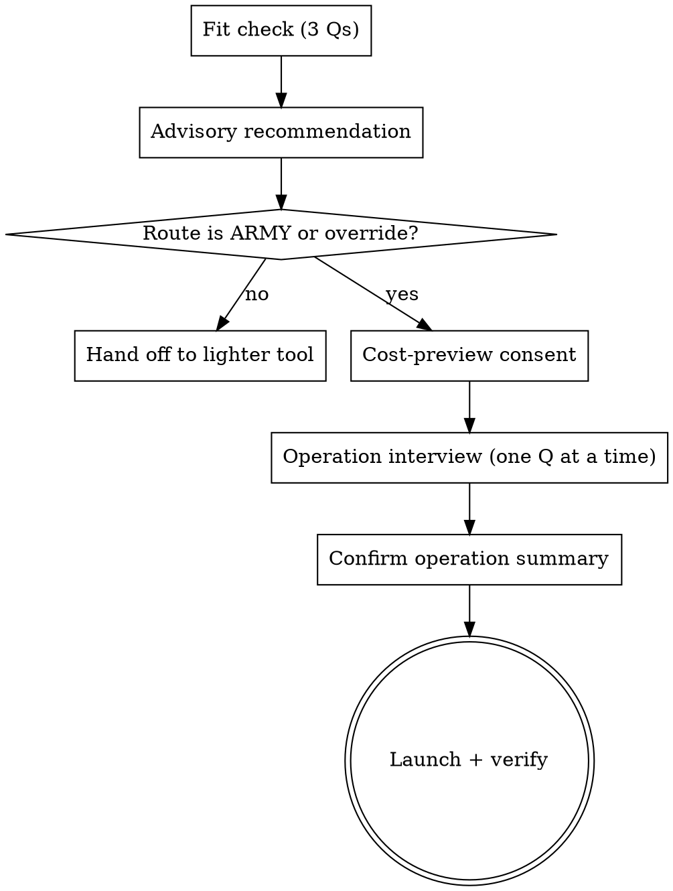

# Agent Army 🫡

## 🪖 Overview
Run a **fleet of autonomous Claude agents in parallel**, one per independent group of work, each in its own git worktree/branch, coordinated by a **master** session through a **command centre** that lives *outside* any repo (in `~/.claude/agent-army/<operation>/`). The command centre is the single source of truth: the master and agents read/write it, and **any session can take command** by reading it — so the operation survives context-window limits and shift changes.

**Core principle:** the master never trusts a single signal. Self-reported status *plus* objective health (process alive + last commit + transcript activity) together tell the truth. Agents stall silently; commits lag reports; launches lie about success. Verify everything.

This is the **heavyweight, separate-session** tool. Its cheaper cousin — in-session subagents — covers most parallel work for free. **The Front Door decides which you need.** See `references/agent-army-vs-subagents.md` for the full comparison and `DECISIONS.md` for why the design is shaped this way.

## 🧭 The workflow: spec in one session, implement in another
Agent-army is the **back half** of a two-session pipeline:
1. **Session A — spec.** Decompose the app into independent seams and write each seam's brief. The **spec source is pluggable**: an **OpenSpec** change dir, **Todoist** tasks, **JIRA** tickets, or just a **markdown brief** (even a near-empty stub the agent fleshes out). One seam = one spec = one future agent.
2. **Session B — implement (this skill).** The master groups those specs and hands one to each agent; the fleet builds them in parallel, each in its own worktree, PRing into the integration branch.

Keep the two sessions **separate on purpose**: speccing is judgement-heavy and interactive; implementation is parallel and autonomous. Splitting them means the build never burns the spec session's context, and the fleet can be (re)launched from the specs at any time.

---

## ⛔ Front Door — run this FIRST, before creating anything

A fleet costs **N full sessions** (real money on API billing; quota+time on a subscription). Most "parallel work" does **not** need it. Walk the Front Door as a **one-question-at-a-time interview** (like `brainstorming`), not a form — route to the cheapest tool that fits, then interview for the operation details.

### Checklist (create one TodoWrite todo per item, complete in order)
1. Fit check — the 3 questions below
2. Advisory recommendation — state the route + reasoning, defer to the user
3. Cost-preview consent
4. Operation interview — load `references/front-door.md`, ask one question at a time
5. Confirm operation summary — echo the manifest back for sign-off
6. Launch + verify

### Step 1 — Fit check (three questions, ask one at a time)
1. **Independent seams?** How many genuinely independent groups, each with a spec, that do NOT touch the same files? This is your agent count (target **4–9**). *<2 independent → not a fleet; 50 tickets in 5 groups = 5 agents.*
2. **Big & time-pressured?** Is each seam hours of work AND is wall-clock the binding constraint? *Small/mechanical → Workflow sweep. No deadline → sequential is cheaper.*
3. **Human will babysit?** Will someone check in to clear BLOCKED decisions? *No → don't launch; idle/blocked agents burn money.*

### Step 2 — Cost preview (informed consent)
Tell the user, explicitly, before launching:
```
  Estimated:  N agents × ~one-session-cost each  +  master coordination  +  idle
  Trade:      you are spending ~N× the tokens to compress ~N units of wall-clock → ~1.
  Billing?
    • Subscription / Max → cost is QUOTA + TIME, not marginal $  (weigh time saved)
    • API / pay-as-you-go → real $  (weigh the dollar number above)
```
Agent-army's *only* value is buying wall-clock + independent context windows + survival. If none of those is the binding constraint, it is the wrong tool.

### Step 3 — Route
```
SHAPE OF THE WORK                                  USE
────────────────────────────────────────────────  ─────────────────────────────
4–9 BIG independent seams, need judgement +        AGENT-ARMY (this skill)
 review loops, span hours/days, human babysits      one agent per seam
                                                   
Many SMALL, mechanical, well-specified, isolated   Workflow tool (in-session,
 tasks (rename, dep bump, header) — little          worktree-isolated, pipelined;
 judgement                                          ~10 concurrent, no windows)
                                                   
A handful of independent tasks you'll finish now   In-session subagents
 in one sitting                                     (Agent/Task tool)
                                                   
Tightly COUPLED work (same files / ordered deps)   Sequential / a few subagents
```
State the recommendation, then defer:
> **Recommendation:** `<ARMY | Workflow | subagents | sequential>` — because `<reason>`.
> This is advisory. Say "proceed with the fleet" to override, or I'll route you to the lighter tool.

If the route is ARMY (or the user overrides), continue to the interview: `references/front-door.md`.

### Front Door flow


---

## ✅ When to use (after the gate says yes)
- Work is **already decomposed** into independent groups with little shared state (specs written, tickets grouped).
- You want parallelism + isolation + a coordinator that outlives one chat.
- **Not for:** a single task, tightly-coupled work needing constant cross-talk, or anything a quick inline subagent / Workflow sweep handles. Reach for this when the scale justifies a standing operation.

## 🎖️ Roles
- **Master** 🧭 — a coordinator session (often the one running this skill). Spawns agents, monitors health, unblocks, reviews PRs into the integration branch, assembles the final PR. **Writes no feature code.** Identity recorded in `master.lock`; changeable.
- **Agents** 🫡 — **semi-autonomous** workers, one per group. Each self-creates its worktree, works **subagent-driven** (coordinator dispatching subagents — keeps its own context lean), commits often, opens a PR to the integration branch, reports status, then `/end`s. Agents hit decisions only a human can make and set themselves BLOCKED — so **this is not fire-and-forget; the human checks in periodically** to clear blocks.

## 🔄 Operation lifecycle
1. **Gather groups.** Confirm the groups of work and each group's spec (an OpenSpec change dir *or* a markdown brief). One group = one agent = one branch.
2. **Pick integration branch + models.** Cut an integration branch (e.g. `release/x` or `integration/<operation>`) off the agreed base; all agent PRs target it. Choose models (see *Choosing models*).
3. **Create the command centre.** `~/.claude/agent-army/<operation>/` — see `templates/command-centre.md`, `templates/agent-brief.md`, `templates/agent-status.md`, and the `manifest.json` shape below. Pick a memorable **operation codename**, not a timestamp.
4. **Launch + verify.** `scripts/launch-agent.sh <operation> <agent>` per agent (visible terminal by default; `--terminal <name>` to pick, `--tmux` only for SSH/headless). **Verify each agent is live within ~15s** — never trust the launch exit code. The launcher records a window handle to `agents/<agent>.runtime.json`.
5. **Monitor (check in periodically — this is semi-autonomous).** `scripts/fleet-status.sh <operation>` is the objective board; `scripts/where.sh <operation>` shows where each window is. Answer `BLOCKED` questions; relaunch `STALLED` with `--resume`, `DYING`/`DEAD` **fresh** (successor reads the continuation); `stop-agent.sh` anything `IDLE-BURN`. Update `COMMAND.md`'s *Last master action* line each time you act.
6. **Assemble.** When all agents are PR-OPEN/DONE: review each PR two-stage (spec then quality — in-session reviewer subagents), merge into the integration branch, run CI, open one PR integration → base. `stop-agent.sh` the fleet, remove worktrees, archive the command centre to `~/.claude/agent-army/archive/`.

## 🗂️ manifest.json (machine-readable spine — scripts read this)
```json
{
  "operation": "operation-azure-falcon",
  "projectRoot": "/abs/path/to/repo",
  "integrationBranch": "release/v2.3.0",
  "integrationBase": "release/v2.3.0",
  "commandCentre": "/Users/you/.claude/agent-army/operation-azure-falcon",
  "stallSeconds": 900,
  "agents": [
    {"name": "g1-auth", "branch": "feature/...", "worktree": "/abs/path/worktrees/g1-auth",
     "spec": "openspec/changes/.../", "model": "sonnet", "startDir": "/abs/path/to/repo"}
  ]
}
```

## 🚀 Launching agents
**Default: a visible stock terminal window** so you can *see* each agent — macOS Terminal.app/iTerm/Warp (via `osascript` or Warp launch config), Linux `gnome-terminal`/`konsole`/`xterm`, Windows `wt.exe`/PowerShell; SSH/headless falls back to `tmux` (or `nohup` with a logfile). Pick one explicitly with `--terminal <name>` (`terminal-app|iterm|warp|gnome-terminal|konsole|xterm|windows-terminal|powershell|tmux|nohup`); `--tmux` is an alias for `--terminal tmux`. tmux is **hidden** (a detached session) — only use it where there's no desktop. Each window is **titled by the agent's group label**. Agents start in `projectRoot` and **create their own worktree** as step 1 of their brief. Autonomous runs use `--dangerously-skip-permissions` — a real security trade-off; only for trusted, sandboxed work.

**Verification is mandatory.** After launch, confirm a `claude` process is actually running for that agent (matched by the unique brief path) within ~15s. A window that opened is not proof the agent started. The launcher also records a runtime handle (substrate + window id/pane/tty + pid) so the master can later **find, inspect, and close** the window.

## 🩺 Health & the source of truth
The board combines two signals — see `scripts/fleet-status.sh`:
- **Self-reported** (`agents/<name>.status.md`, agent-owned, milestone-based): `SPAWNING / BOOTSTRAPPING / WORKING / BLOCKED / DONE_WITH_CONCERNS / TESTING / PR-OPEN / DYING / DONE / FAILED`.
- **Objective** (master-derived): process alive? last commit age? transcript mtime? → `ALIVE / BLOCKED / CONCERNS / DYING / STALLED / DEAD / DONE / IDLE-BURN`. Liveness is **hardened** — alive if the recorded PID runs, OR a process matches the brief path, OR a process cwd is under the worktree — so a live agent can't go invisible (a bug the cwd-only probe used to have). Per-agent files mean no concurrent-write corruption; the directory *is* the one logical source of truth.

Relaunch modes — pick by *why* it stopped:
- **STALLED** (alive, no progress past `stallSeconds`) = silent usage-limit freeze; context is fine → `launch-agent.sh … --resume` (`claude -c`, same conversation).
- **DYING / DEAD-after-DYING** = context ran out; the agent already wrote a continuation → relaunch **fresh** (no `--resume`); the new agent reads the continuation and resumes with a clean window.
- **BLOCKED** = needs a human decision; answer the question in its status file, then nudge it.
- **IDLE-BURN / ORPHAN** = the agent is DONE but its session is still alive, paying a meter → `stop-agent.sh <op> <agent>`.

### 🔭 Finding & closing windows
```bash
scripts/where.sh <operation>            # per agent: substrate, live pid, how to inspect, how to close
scripts/stop-agent.sh <operation> <a>   # graceful /exit + close the exact window, verified
```
This is the answer to "where are my agents?" and "stop the ones that are done." The handle is recorded at launch; `where.sh` re-verifies liveness three ways before reporting.

### 🫀 Keeping agents alive on a small context window
Two mechanisms, both in the agent brief: (1) **subagent-driven work** so the main thread stays a thin coordinator and the heavy context lives in disposable subagents — the main defence on Sonnet; (2) the **DYING protocol** — at ~80% context the agent commits, writes a continuation, marks itself DYING, and `/end`s, so a fresh successor picks up cleanly with zero lost work.

## 🛂 Master's review gate (borrowed from subagent-driven-development)
The master does **not** merge on an agent's self-report. For each PR, dispatch reviewer **subagents in the master's own session** (cheap, no new windows) — **spec-compliance first, then code-quality**, looping until both ✅ — and read any `DONE_WITH_CONCERNS` notes before merging. The agents build in separate windows; the master reviews in-session. See the review section in `templates/command-centre.md`.

## 🧠 Choosing models
Make model per-agent in the manifest. Cheapest-that-works:
- **Uniform** (default): one tier for all — `sonnet` is the cost/quality sweet spot when specs are already written.
- **By size:** S→haiku/sonnet, M→sonnet, L/complex→opus. Strong-model-low-effort is a good call when the spec does the thinking and the agent mostly transcribes.
- Inside each agent, the agent picks **per-subtask** models (mechanical→cheap, judgement→capable), same as subagent-driven-development.

**On Sonnet's context window:** it's the cost sweet spot but the window is tight. The fix is *architecture, not model* — agents working subagent-driven keep the main thread small, and the DYING protocol resets cleanly when it does fill.

## 🔁 Changing the master (shift change)
`master.lock` holds the current master's identity + heartbeat. To take command: read `COMMAND.md` top-to-bottom, run `fleet-status.sh` + `where.sh`, reconcile against the status files, then overwrite `master.lock` with your identity + timestamp. No code state is held in the master's head — it all lives in the command centre.

## ⚠️ Hard rules (lessons paid for in lost time)
- **Run the Front Door first.** A fleet you didn't need is the most expensive mistake here.
- **Verify liveness; never trust a launch's exit code.** (Ghostty `open -na … -e` silently orphans on macOS — prefer tmux.)
- **Agents stall silently at account usage limits.** Watch for ALIVE-but-no-progress; that's STALLED, not working.
- **Stop DONE agents.** IDLE-BURN is real money; `stop-agent.sh` them.
- **Don't kill "the duplicate" claude process** — there's one live agent per worktree plus its launcher shell. Killing the agent loses its in-context work.
- **Commit before yielding.** Working trees are fragile; WIP commits are recoverable. Agents commit before every report and before `/end`.
- **Agents PR to the integration branch, never the main branch; never force-push; never move tickets** unless the brief says so.
- **Respect do-not-touch zones** (other people's active streams) — enforce in review.

## 📁 Files in this skill
- `templates/command-centre.md` — master `COMMAND.md` doc (now with the review gate + teardown).
- `templates/agent-brief.md` — durable per-agent brief (worktree self-creation + reporting + richer statuses).
- `templates/agent-status.md` — per-agent status block (full status vocabulary).
- `scripts/launch-agent.sh <op> <agent> [--resume] [--terminal <name>] [--tmux]` — portable launch + verify + record handle.
- `scripts/fleet-status.sh <op>` — objective health board (hardened liveness + IDLE-BURN).
- `scripts/where.sh <op> [agent]` — locate each agent's window; how to inspect/close.
- `scripts/stop-agent.sh <op> <agent> [--force]` — graceful close, verified; kills idle-burn.
- `references/front-door.md` — the one-question-at-a-time operation interview.
- `references/agent-army-vs-subagents.md` — when to use a fleet vs subagents vs Workflow.
- `DECISIONS.md` — design rationale and the decisions behind this skill.

## 🚧 Common mistakes
- **Skipping the Front Door** → launching a fleet for work a Workflow sweep or a few subagents would do at a fraction of the cost.
- Relying on self-reported status alone → you miss silent stalls. Use the objective probe.
- Pre-creating worktrees for agents → bootstrapping coupling; let agents self-create (cleaner isolation, matches teardown).
- Putting the command centre inside the repo → it gets caught in branch switches/cleanups. It lives in `~/.claude`, referenced by absolute path so agents in any worktree reach it.
- One giant shared status file → concurrent-write corruption. One file per agent.
- Spawning more agents than the work has independent seams → cross-talk and merge pain. One agent per genuinely independent group.
- Leaving DONE agents running → idle-burn. Stop them.
