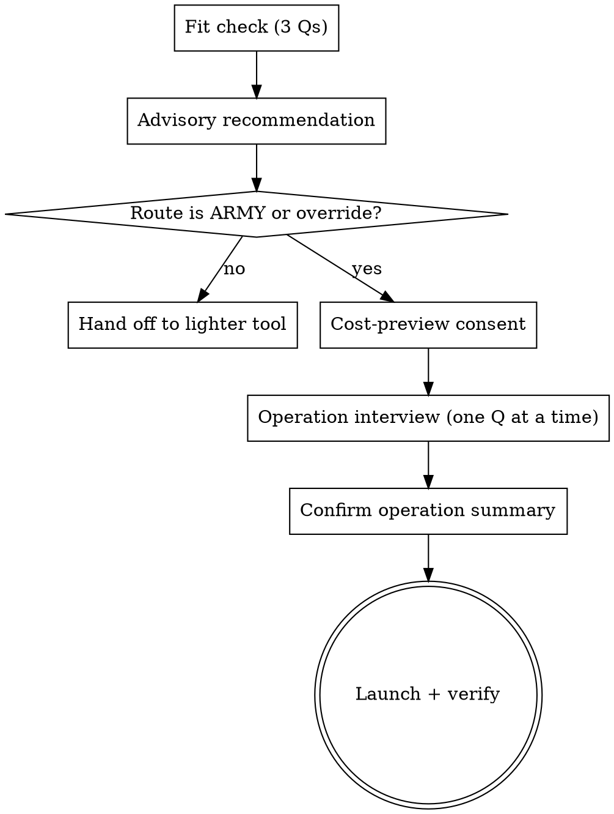

# Front Door Implementation Plan

> **For agentic workers:** REQUIRED SUB-SKILL: Use superpowers:subagent-driven-development (recommended) or superpowers:executing-plans to implement this plan task-by-task. Steps use checkbox (`- [ ]`) syntax for tracking.

**Goal:** Reshape agent-army's Intake Gate into a `brainstorming`-faithful Front Door — a one-question-at-a-time interview with an advisory route recommendation, split into a lean SKILL.md gate plus a loaded `references/front-door.md` interview script.

**Architecture:** Pure skill-markdown change. SKILL.md keeps the always-loaded gate (3-question fit check → advisory recommendation → cost consent → checklist + flow diagram) and points to a new `references/front-door.md` that holds the one-at-a-time interview (groups, branch, codename, terminal, models, permissions, babysit, stallSeconds), which terminates by writing `manifest.json` + `COMMAND.md`. No scripts/templates touched. No hook, no persisted config.

**Tech Stack:** Markdown skill files; bash one-liners for terminal auto-detection guidance.

Spec: `docs/specs/2026-06-16-front-door-design.md`.

---

### Task 1: Create the interview reference

**Files:**
- Create: `skills/agent-army/references/front-door.md`

- [ ] **Step 1: Write `references/front-door.md`**

Content requirements (one section per interview question, in order; each question states the *recommended option first*, asked fresh every operation):

1. Intro: "Run only after the SKILL.md gate recommends ARMY (or the user overrode). Ask ONE question per message, multiple-choice where possible. Do not batch."
2. **Groups/seams** — confirm each independent group + its spec (OpenSpec change dir OR markdown brief). One group = one agent = one branch. Cannot be guessed; always ask.
3. **Integration base + branch** — recommend `integration/<codename>` cut off the current branch; confirm the base.
4. **Codename** — offer a generated memorable codename (e.g. `operation-azure-falcon`), not a timestamp.
5. **Terminal** — auto-detect present substrates and offer ONLY those. Include this probe block:
   ```bash
   # macOS desktop terminals
   [ "$(uname)" = Darwin ] && ls -d /Applications/iTerm.app /Applications/Ghostty.app 2>/dev/null
   echo "TERM_PROGRAM=${TERM_PROGRAM:-}"      # Apple_Terminal | iTerm.app | ghostty | vscode
   command -v tmux >/dev/null && echo "tmux available"
   [ -n "${SSH_TTY:-}" ] && echo "headless/SSH — prefer tmux"
   ```
   Recommend tmux for SSH/headless; Terminal.app on mac desktop. Carry the Ghostty-orphan warning (`open -na … -e` silently orphans → prefer tmux).
6. **Models** — recommend uniform `sonnet`; offer by-size (S→haiku/sonnet, M→sonnet, L→opus).
7. **Permissions** — supervised vs autonomous (`--dangerously-skip-permissions`); spell out the trade-off (autonomous only for trusted/sandboxed work).
8. **Babysit cadence** — confirm a human will check in; capture a rough interval.
9. **stallSeconds** — default 900; only ask if they care.
10. **Terminus** — write the answers into `manifest.json` (the spine shown in SKILL.md) and `COMMAND.md`, then return to SKILL.md lifecycle step 3 (create command centre) → step 4 (launch + verify).

- [ ] **Step 2: Verify the file exists and is non-empty**

Run: `test -s skills/agent-army/references/front-door.md && echo OK`
Expected: `OK`

- [ ] **Step 3: Commit**

```bash
git add skills/agent-army/references/front-door.md
git commit -m "feat(front-door): add one-at-a-time interview reference"
```

---

### Task 2: Reshape the SKILL.md gate into the Front Door

**Files:**
- Modify: `skills/agent-army/SKILL.md` (the `## ⛔ Intake Gate` section, lines ~17–56)

- [ ] **Step 1: Replace the section heading and intro**

Rename `## ⛔ Intake Gate — run this FIRST, before creating anything` to
`## ⛔ Front Door — run this FIRST, before creating anything`.
Keep the cost-justification sentence. Add: "Walk it as a one-question-at-a-time interview (like `brainstorming`), not a form."

- [ ] **Step 2: Add the checklist (create one todo per item)**

```markdown
### Checklist (create one TodoWrite todo per item, complete in order)
1. Fit check — the 3 questions below
2. Advisory recommendation — state the route + reasoning, defer to the user
3. Cost-preview consent
4. Operation interview — load `references/front-door.md`, ask one question at a time
5. Confirm operation summary — echo the manifest back for sign-off
6. Launch + verify
```

- [ ] **Step 3: Replace the 6-question fit check with 3**

```markdown
### Step 1 — Fit check (three questions, ask one at a time)
1. **Independent seams?** How many genuinely independent groups, each with a spec, that do NOT touch the same files? This is your agent count (target 4–9). *<2 independent → not a fleet.*
2. **Big & time-pressured?** Is each seam hours of work AND is wall-clock the binding constraint? *Small/mechanical → Workflow sweep. No deadline → sequential is cheaper.*
3. **Human will babysit?** Will someone check in to clear BLOCKED decisions? *No → don't launch; idle/blocked agents burn money.*
```

- [ ] **Step 4: Add the flow diagram (after the routing table)**



- [ ] **Step 5: Soften Step 3 routing from hard-stop to advisory**

Replace "Only proceed past this gate if Step 3 lands on AGENT-ARMY. Otherwise hand off to the right tool and stop." with:

```markdown
State the recommendation, then defer:
> **Recommendation:** `<ARMY | Workflow | subagents | sequential>` — because `<reason>`.
> This is advisory. Say "proceed with the fleet" to override, or I'll route you to the lighter tool.

If the route is ARMY (or the user overrides), continue to the interview: `references/front-door.md`.
```

- [ ] **Step 6: Verify no stale phrasing and the diagram is balanced**

Run: `grep -n "Intake Gate" skills/agent-army/SKILL.md`
Expected: only the references in *Hard rules* / *Common mistakes* / front-matter that you will update in Task 3 (note them; do not fail).
Run: `grep -c '\->' skills/agent-army/SKILL.md`
Expected: ≥ 7 (the new flow edges present).

- [ ] **Step 7: Commit**

```bash
git add skills/agent-army/SKILL.md
git commit -m "feat(front-door): reshape gate into brainstorming-style interview"
```

---

### Task 3: Reconcile cross-references and metadata

**Files:**
- Modify: `skills/agent-army/SKILL.md` (front-matter, *Files in this skill*, *Hard rules*, *Common mistakes*)
- Modify: `.claude-plugin/plugin.json`, `.claude-plugin/marketplace.json`
- Modify: `CHANGELOG.md`

- [ ] **Step 1: Update SKILL.md front-matter and body references**

In the front-matter `description`, change "ALWAYS run the Intake Gate below first" → "ALWAYS run the Front Door below first".
In *Files in this skill*, add: `- references/front-door.md — the one-question-at-a-time operation interview.`
In *Hard rules*, change "Run the Intake Gate first." → "Run the Front Door first."
In *Common mistakes*, change "Skipping the Intake Gate" → "Skipping the Front Door".
In the Overview paragraph (line ~13), change "The Intake Gate decides which you need." → "The Front Door decides which you need."

- [ ] **Step 2: Update plugin metadata**

In `.claude-plugin/plugin.json` and `.claude-plugin/marketplace.json`, change the description phrase "Opens with an Intake Gate that routes cheap work to subagents/Workflow instead." → "Opens with a Front Door interview that routes cheap work to subagents/Workflow instead." Bump `version` `0.1.0` → `0.2.0` in both the marketplace plugin entry and `.claude-plugin/plugin.json`.

- [ ] **Step 3: Add CHANGELOG entry**

Prepend a `## 0.2.0` entry: "Reshaped the Intake Gate into a brainstorming-style Front Door — 3-question fit check, advisory routing, one-question-at-a-time operation interview (`references/front-door.md`) covering terminal/models/permissions."

- [ ] **Step 4: Verify all stale references are gone**

Run: `grep -rn "Intake Gate" skills/agent-army/ .claude-plugin/ CHANGELOG.md`
Expected: no matches (the CHANGELOG line phrases it as "Reshaped the Intake Gate into…" which is historical and allowed — if present, that single line is OK).
Run: `test -f skills/agent-army/references/front-door.md && echo OK`
Expected: `OK`

- [ ] **Step 5: Commit**

```bash
git add skills/agent-army/SKILL.md .claude-plugin/plugin.json .claude-plugin/marketplace.json CHANGELOG.md
git commit -m "chore(front-door): reconcile references, bump to 0.2.0"
```

---

### Task 4: Record the decision

**Files:**
- Modify: `skills/agent-army/DECISIONS.md`

- [ ] **Step 1: Append a decision entry**

Add: "**Front Door over bare Intake Gate.** The gate now runs as a one-question-at-a-time interview (brainstorming-faithful) with an *advisory* route recommendation rather than a hard stop, and asks operation prefs (terminal/models/permissions) up front, asked fresh each operation (no persisted config). Interview script lives in `references/front-door.md` to keep SKILL.md scannable. No hook/plugin conversion — the skill auto-triggers on its description."

- [ ] **Step 2: Commit**

```bash
git add skills/agent-army/DECISIONS.md
git commit -m "docs(front-door): record design decision"
```

---

### Task 5: Final dry walkthrough

- [ ] **Step 1: Read SKILL.md top-to-bottom** and confirm the Front Door reads as a coherent interview, the flow diagram edges resolve, and the routing table still backs the recommendation.

- [ ] **Step 2: Read `references/front-door.md`** and confirm every interview question has a recommended default and the terminus writes `manifest.json` + `COMMAND.md`.

- [ ] **Step 3: Confirm referenced files all exist**

Run: `for f in references/front-door.md templates/command-centre.md scripts/launch-agent.sh; do test -f "skills/agent-army/$f" && echo "ok $f"; done`
Expected: three `ok` lines.

- [ ] **Step 4: No commit** (read-only verification). Report results.

---

## Self-Review

- **Spec coverage:** SKILL.md gate reshape (Task 2) ✓; advisory recommendation (Task 2 Step 5) ✓; 3-question fit check (Task 2 Step 3) ✓; one-at-a-time interview reference (Task 1) ✓; terminal auto-detect (Task 1 Step 1 §5) ✓; ask-fresh/no-config (Task 1 intro) ✓; lean SKILL.md + reference split (Tasks 1+2) ✓; no hook (Task 4 note) ✓; scope guards / scripts untouched (no task modifies scripts) ✓.
- **Placeholder scan:** none — every step has concrete content or an exact command.
- **Consistency:** the file `references/front-door.md` name is used identically across Tasks 1–5; version bump `0.2.0` consistent across plugin.json, marketplace.json, CHANGELOG.
